# TJBot Photo Booth

This project provides the Node-RED and Cloud Function code to build a TJBot Booth. 

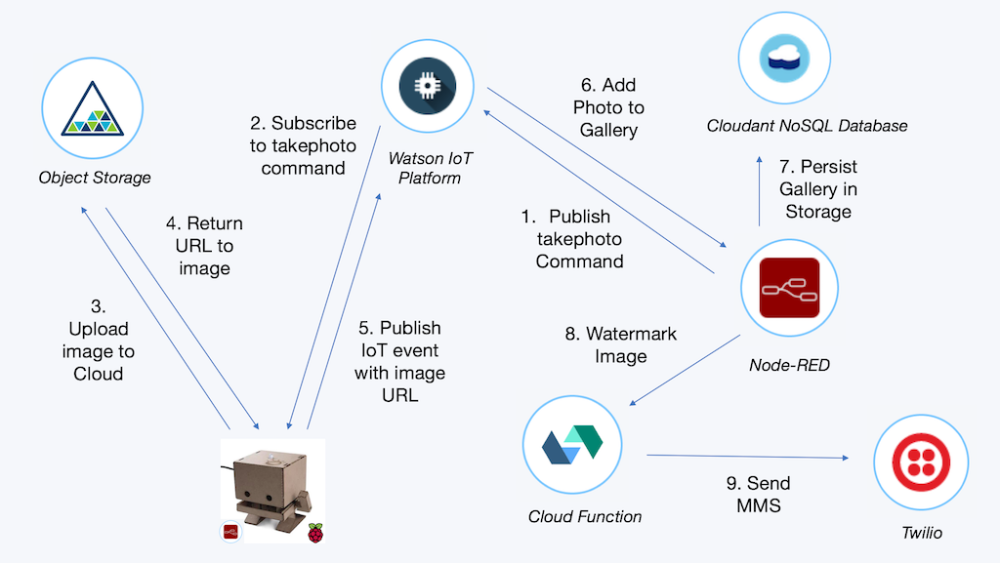

There are two components to the photo booth: a Node-RED flow running on the Raspberry Pi that controls the TJBot. When the TJBot receives a _takephoto_ command, it captures and uploads the photo, and publishes _camerastatus_ and _phototaken_ events to the Watson IoT Platform. A Node-RED application running in IBM Cloud subscribes to these events, maintains a gallery of photos, and sends MMS messages via Twilio. The photos are stored in an Object Storage service.

## Object Storage

Photos are stored in an IBM Cloud Object Storage service. This section describes how to create an Object Storage service and create a container.

1. Create an [Object Storage service](https://console.bluemix.net/catalog/infrastructure/object-storage-group) in IBM Cloud

	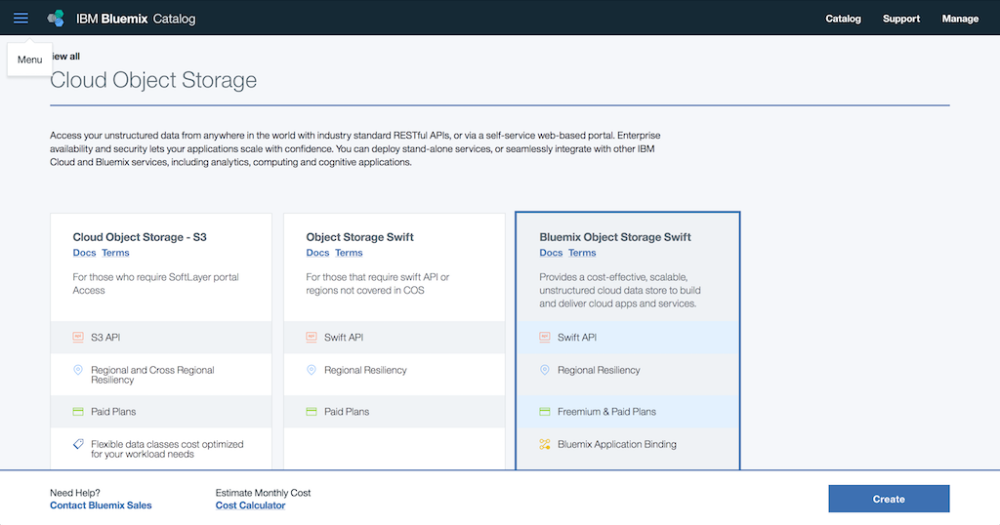

1. Create a container named _photobooth_

	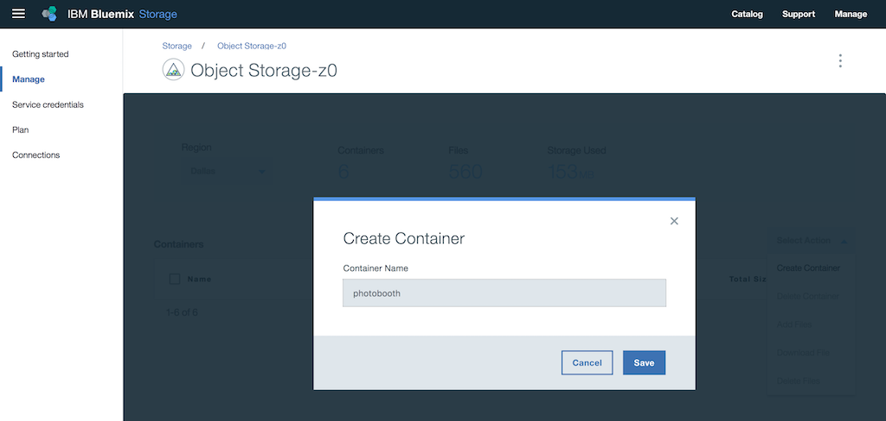
	
1. Copy the service credentials for use later on in the object storage nodes in Node-RED running on both the TJBot and in IBM Cloud.

	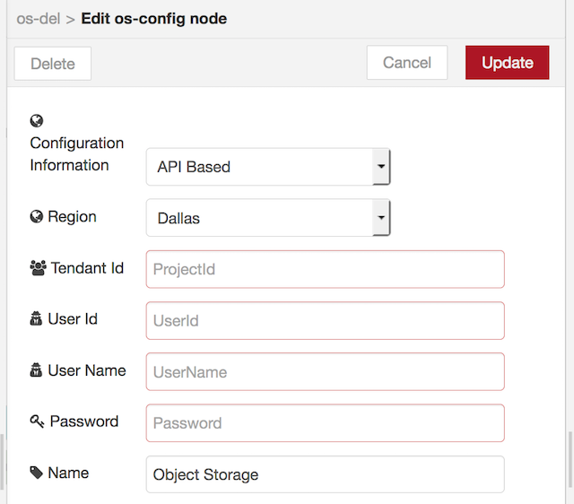

## Cloud Functions

This project uses two Cloud Functions to: 

1. watermark the image by overlaying a graphic over the selected photo
2. send an image as an MMS with the Twilio API

This section describes how to create the two Cloud Functions, via the IBM Cloud console and from the command line.

### Cloud Function to Watermark Image

The file [watermark.js](code/watermark.js) contains the Cloud Function that overlays one image on top of another. This Cloud Function can be created in the IBM Cloud console.

1. Create a new action. Make sure to check the box labeled _Enable as Web Action_.

	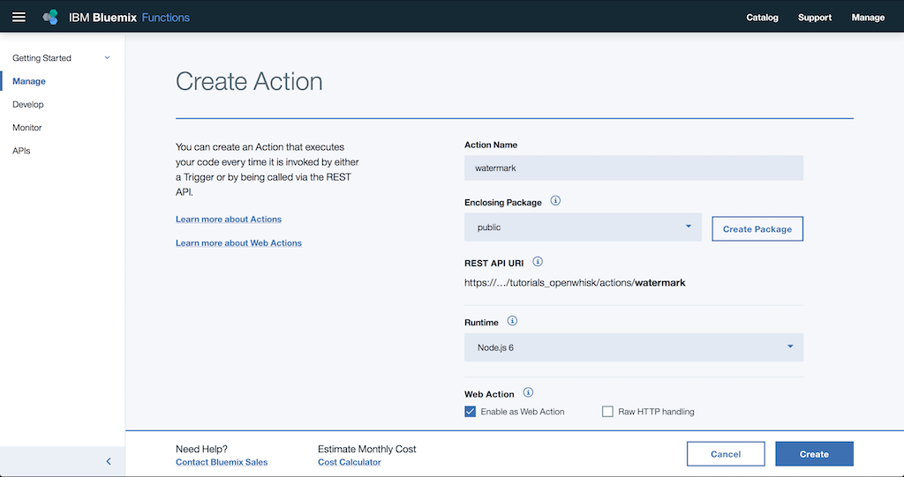

1. Copy and paste the Node.js code from [watermark.js](code/watermark.js) into the Code textbox.

	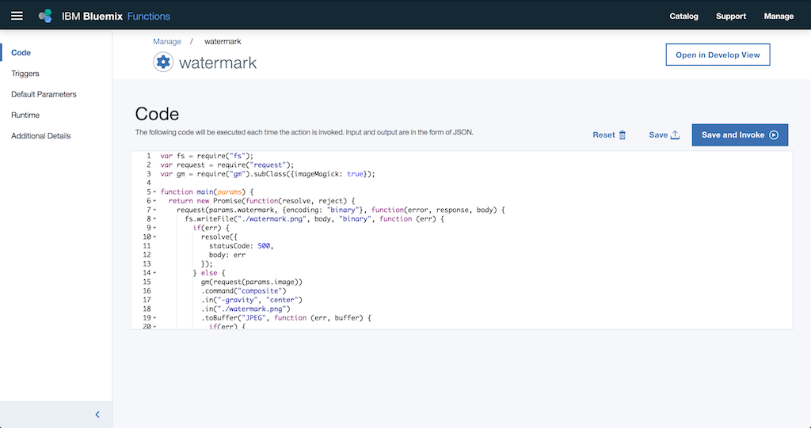

### Cloud Function to Send Twilio MMS

The directory [code/twilio-send-photo](code/twilio-send-photo) includes the Cloud Function that sends an image as an MMS message with the Twilio API. Because the action requires the twilio npm package, a zip file containing all the necessary parts (code and node modules) is built and uploaded via a shell script.

1. Install the Cloud Function CLI by [following these instructions](https://console.bluemix.net/openwhisk/learn/cli).

1. Edit the file local.env. Put the Twilio Account SSID and Auth Token in this file.

1. To install the required npm modules and zip up the action, run the shell script
	
	```
	./deploy.sh --build
	```

1. To deploy the Cloud Function, run the shell script
	
	```
	./deploy.sh --install
	```

1. To update the Cloud Function, run the shell script (you may need to --build first)
		
	```
	./deploy.sh --update
	```

1. Copy the Cloud Function Web Action URL from the IBM Cloud dashboard into the configuration node in the Node-RED application in the next section.

	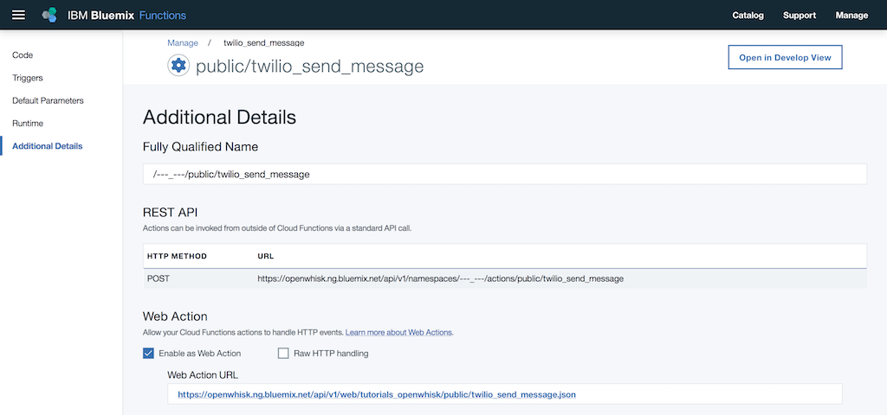

## Node-RED Image Gallery Application in IBM Cloud

The Node-RED application in IBM Cloud provides controls to take a photo, displays the gallery of photos taken, and a phone number input to capture the destination an MMS should be sent.

This section describes how to create the Node-RED boilerplate application and configure the application.

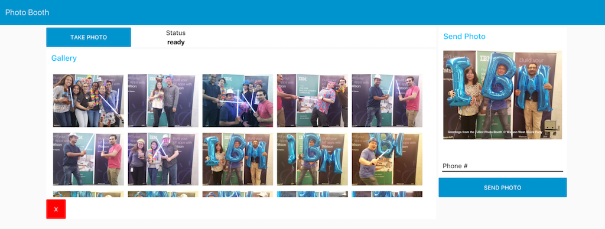
_Node-RED dashboard to command TJBot to take a photo, display a gallery, and input to send a MMS message_

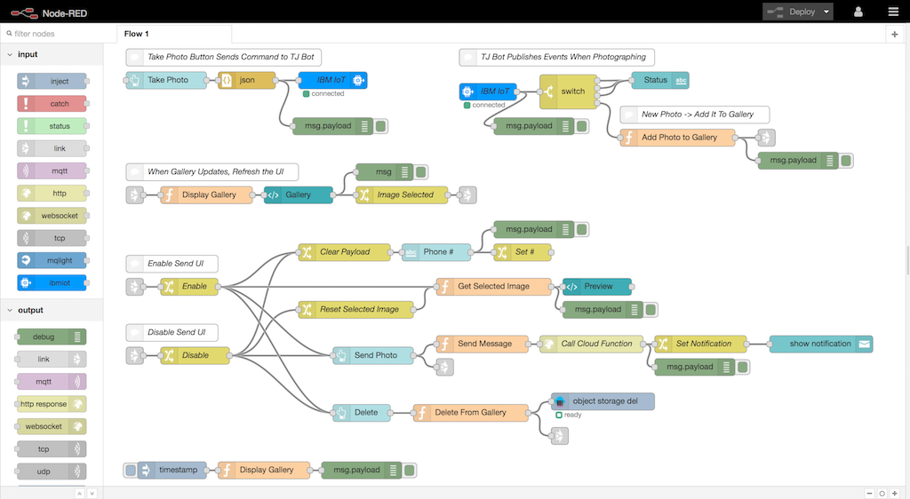	
_Node-RED flow to run the Gallery application_

1. Create an [IoT Starter boilerplate application](https://console.bluemix.net/catalog/starters/internet-of-things-platform-starter) in IBM Cloud. This will create a Node-RED application with a Watson IoT Platform service.

	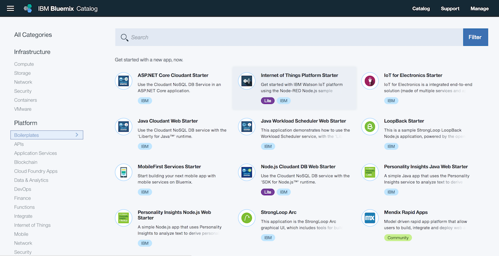

1. Import the JSON from the file named [bluemixflow.json](code/bluemixflow.json)

1. Register a device type of _tjbot_ and a device with id _photobooth_. Update the IoT nodes with the device credentials.

	

1. Set the configuration node with the Cloud Function endpoints, the Twilio phone number, watermark image and text message.

	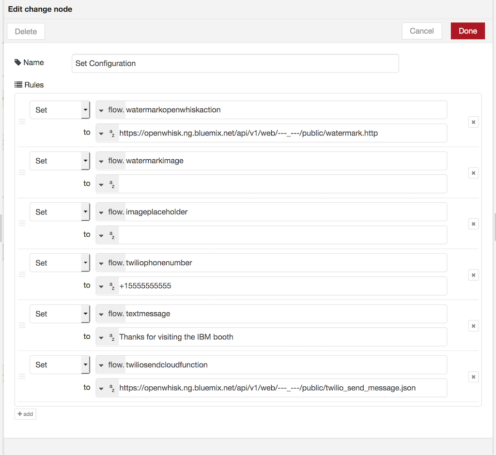

Deploy the application and confirm the Node-RED dashboard renders.

## Node-RED TJBot Setup

The TJBot subscribes to a takephoto command via the Watson IoT Platform. When this command is received, the flow will:

1. light the LED the color red to signal it is about to take a photo
2. publish a _camerastatus_ event with status of _taking_
3. take a photo
4. turn off the LED
5. publish an _camerastatus_ event with status of _uploading_
6. upload the image to Object Storage
7. publish an _camerastatus_ event with status of _ready_
8. publish an _phototaken_ event with the image URL

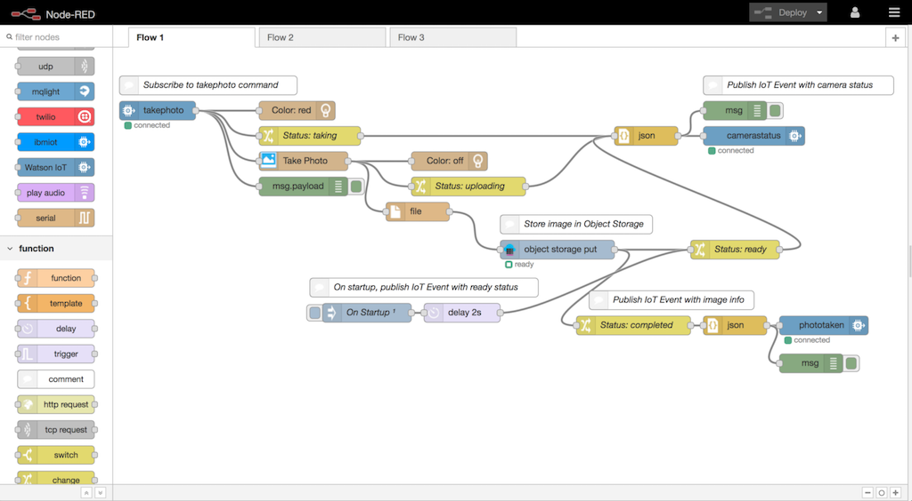

This section describes how to setup the TJBot with the Node-RED flow and necessary credentials.

1. Install the TJBot Node-RED nodes onto the Raspberry Pi. Refer to this [Medium post](https://medium.com/@jeancarlbisson/setting-up-your-tjbot-to-use-node-red-df94ff94a114) for more information.

	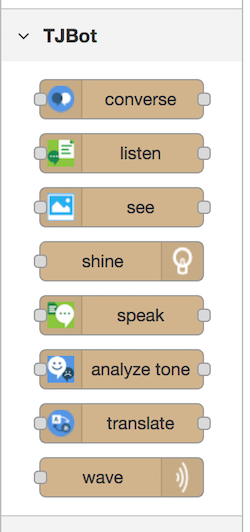

1. Import the JSON from the file named [raspberrypiflow.json](code/raspberrypiflow.json) into Node-RED running on the Raspberry Pi.

1. Add the IBM Cloud Object Storage service credentials into the object storage node.

	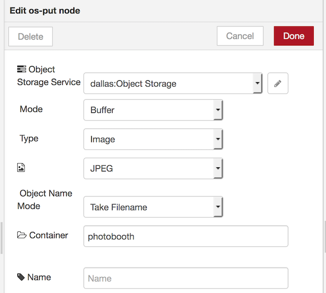

1. Add the device credentials from the Watson IoT Platform.

	
	
## Twitter	

This section describes how to configure the photo booth to tweet photos in addition to send a text message. The additional flows can be imported using the JSON in the [code/twitter.json](code/twitter.json) file.

The first modification is to add the text input element into the Node-RED dashboard interface.

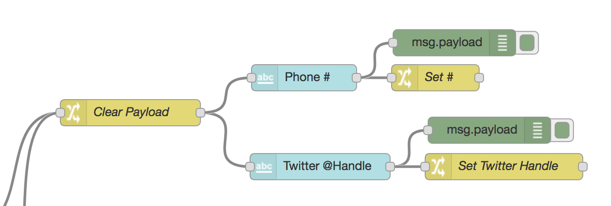

The second modification is to add the functionality to send a tweet if a Twitter handle is provided.


1. Import the JSON from the file named [twitter.json](code/twitter.json)

2. Double click on the Twitter node and authenticate with a Twitter account.

    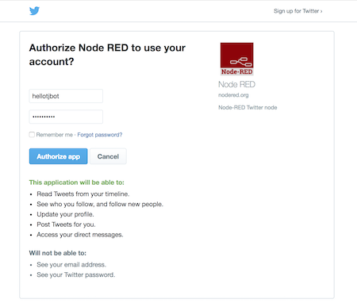
    
3. Configure the tweet content in the **Set Configuration** node.

    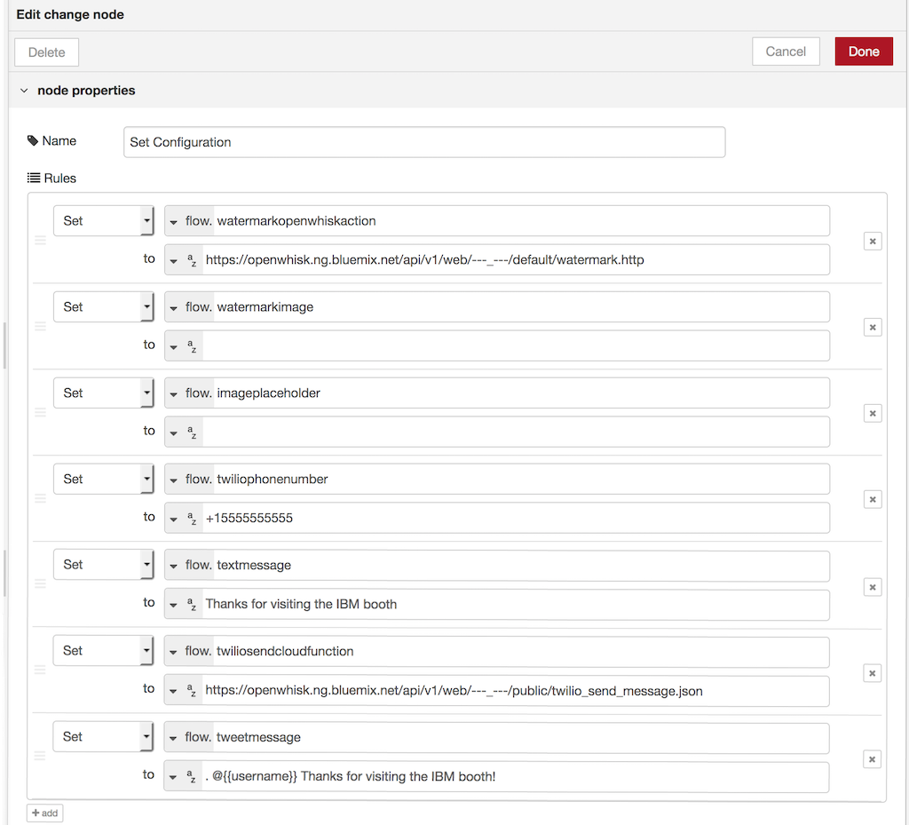

4. Deploy the changes and access the Node-RED dashboard interface.

    
    
Here's an example of what the tweet looks like in the Twitter timeline.

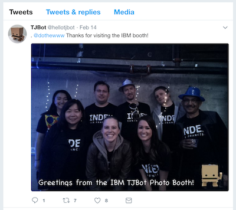
    
## License

This code is licensed under Apache 2.0. Full license text is available in [LICENSE](LICENSE).


